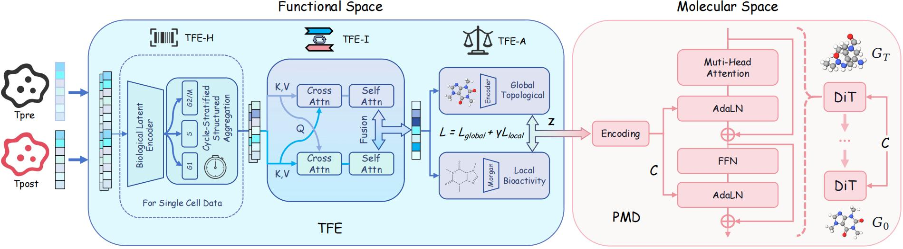

# Reading the Cell, Designing the Cure: Perturbation-Conditioned Molecular Diffusion for Function-Oriented Drug Design
---
# Overview
When reliable target structures are unavailable at scale or phenotypes arise from dysregulated pathways, transcriptomic perturbations provide a system-level functional readout for drug action. 
We formulate *Transcriptome-based Drug Design (TBDD)*, a reverse design setting complementary to perturbation prediction that generates molecular graphs conditioned on desired transcriptomic state transitions. 
TBDD is inherently ill-posed and further challenged by the biology--chemistry modality gap and sparse, noisy single-cell signals. 
We propose **CURE** (A **C**ell**U**lar **R**esponse **E**ngine for Transcriptome-based Drug Design), a multi-resolution transcriptome-guided diffusion framework with a **Transcriptome Perturbation Functional Feature Extractor (TFE)**: **TFE-I** distills function-oriented perturbation embeddings from pre/post states, **TFE-A** aligns them to dual chemical views (topology and fingerprint) to stabilize conditional diffusion, and **TFE-H** performs heterogeneity-aware aggregation to extract state-specific signals from sparse transcriptomic data for robust conditioning. 
Extensive evaluations on bulk and single-cell benchmarks under in-distribution and OOD protocols show that **CURE** consistently outperforms strong baselines in structural quality and function-consistency proxies, and we further demonstrate practical utility via a zero-shot gene-inhibitor design task.

This is the code for CURE. The CURE architecture is as following.



---

## Environment

All environmental dependencies are listed in the `requirements.txt` file.


## Project Structure​

```bash
project-root/
├── DiT/         # CURE's main architecture, for conditional molecule generation.
├── Graph_VAE/   # Global topological VAE
├── molgene/     # TFE-A Training​
├── fig          # Figures related to the paper's explanation​
```

## Data & Checkpoint Available

In our experiments, we utilized the L1000 dataset for bulk data and the Tahoe-100M dataset for single-cell data, both of which are publicly available datasets. The gene inhibitor data was sourced from ExCape, which is also an open-source resource.


In order to comply with the double-blind principle of the conference, after the meeting, the checkpoints will be open sourced.

## Inference
To implement inference on the model, please follow these steps:
1. Navigate to the working directory:
```bash
cd ./DiT/dit
```
2. Run the following command to execute inference:
```bash
python main.py --config-name=config.yaml  init_task="smiles_feat_l1000_other" ckpt_path="./checkpoint/l1000.ckpt" run_mode="test"
```
`init_task` is used to select the inference mode: bulk -> `smiles_feat_l1000_other`, single_cell -> `smiles_feat_t_align`
`ckpt_path` is used to select the inference checkpoint: bulk -> `./checkpoint/l1000.ckpt`, single_cell -> `./checkpoint/tahoe.ckpt`


## Training

To implement training on the model, please follow these steps:
1. Training Global topological VAE:
    + Extract all SMILES molecules in the dataset
    + Extract substructure vocabulary from a given set of molecules:
        ```bash
        cd ./Graph_VAE
        python get_vocab.py --ncpu 16 < data/l1000/all.txt > vocab.txt
        ```
    + Preprocess Graph VAE training data:
        ```bash
        python preprocess.py --train data/l1000/all.txt --vocab data/l1000/all.txt --ncpu 16 --mode single
        mkdir train_processed
        mv tensor* train_processed/
        ```
    + Train graph VAE model
        ```bash
        mkdir ckpt/l1000-pretrained
        python train_gene_muti.py --train train_processed/ --vocab data/l1000/vocab.txt --save_dir ckpt/l1000-pretrained
        ```
2. Dual-domain Alignment Training​:
    ```bash
    cd ./molgene
    python l1000_hgraph_align_train.py
    python l1000_fingerprint_align_train.py
    ```
3. Multi-Resolution Transcriptome-Guided Diffusion Models Training​:
    + Generate conditions for the drug molecule dataset
        ```bash
        python l1000_hgraph_align_infer.py
        python l1000_fingerprint_align_infer.py
        ```
    + Package the conditions csv files into `./DiT/data/raw`, then train the DiT part of CURE.
        ```bash
        cd ./DiT/dit
        python main.py --config-name=config.yaml  init_task="smiles_feat_t_align" run_mode="train"
        ```


## Acknowledgements​
We extend our gratitude to the open-source works mentioned in the paper for their significant contributions.
